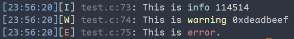

<center>
  
<h2 align="center">Holog</h2>
</center>

<div align="center">
<strong>
      A highly customizable, low-coupling, multi-platform, user-friendly logging project  <br>
    specifically designed for embedded platforms.
</strong>
</div>

---

### Features：
- 🔗 Publish-Subscribe Pattern, support multi-devices(abstract logger object)
- 🖥️ Highly Customizable, user can customize styles of log easily.
- 🌍 Embedded Platform and multi-system support, Such as FatFs, LittleFS, windows and linux.
- 🛠️ Support standard output, also compatible with Serial port(need a little of porting).
- 🚀 Easy-to-use, just need follow example, you can start quickly.

---

### 🚀 Quickly Start：

First, you need pull this repo, use SSH:  
```shell
git clone --recurse-submodules git@github.com:Hotakus/holog.git
cd holog
```

Now you can use build.sh to build this project, or use your CMakeLists.txt to import this project:

**1️⃣ Use "CMakeLists.txt" to import:**  
in your project(not this project), write below:
```cmake
# include ".h" file
include_directories(./your_holog_path/holog)
# add holog as subproject
add_subdirectory(./your_holog_path/holog)

add_executable(your_project_exe ${YOUR_SRCS})
# below the "add_executable()", add holog as static lib
target_link_libraries(your_project_exe holog)
```
now, rebuild your project, the holog will be compiled with your project.

**2️⃣ Or use "build.sh":**  
In the root of HoLog, in shell:
```shell
# no parameters, generate 'holog' directory, include holog.a and all header files 
./build.sh

# with '-D' parameters
# -DHOLOG_USE_TEST : generate holog executable file in ./bin for test
./build.sh -DHOLOG_USE_TEST
```

---

### ⌨️ Code Eaxmple
**1️⃣ Basic usage:**
```c
#include "holog.h"
int main() {
    // initializing HoLog
    holog_init();
    
    // To use HoLog, you need create log device.
    // holog()->create() has 4 params,
    // First param    : unique device name
    // Second param   : holog_device_type_t, device types
    // Third param    : holog_level_t, log level, can compose different level
    // Last param     : linefeed, CRLF or LF, adjust according to your situation
    // tip: if level was not enable, the device will ignore corresponding level 
    holog_device_t *stdout_dev = holog()->create("stdout", HOLOG_DEVICE_TYPE_STDOUT, HOLOG_LEVEL_ALL, HOLOG_LINEFEED_CRLF);
    holog_device_t *info_dev = holog()->create("info_dev", HOLOG_DEVICE_TYPE_COMMON_FILE, HOLOG_LEVEL_INFO, HOLOG_LINEFEED_LF);
    holog_device_t *warning_dev = holog()->create("warning_dev", HOLOG_DEVICE_TYPE_COMMON_FILE, HOLOG_LEVEL_WARNING, HOLOG_LINEFEED_LF);
    holog_device_t *error_dev = holog()->create("error_dev", HOLOG_DEVICE_TYPE_COMMON_FILE, HOLOG_LEVEL_ERROR, HOLOG_LINEFEED_LF);
    holog_device_t *mix_dev = holog()->create("mix_dev", HOLOG_DEVICE_TYPE_COMMON_FILE, HOLOG_LEVEL_ALL, HOLOG_LINEFEED_LF);
    
    // if you enable file support in 'holog_conf.h'
    // you must set the log path(exclude stdout).
    holog()->set_log_path(stdout_dev, NULL);
    holog()->set_log_path(info_dev, "./info.log");
    holog()->set_log_path(warning_dev, "./warning.log");
    holog()->set_log_path(error_dev, "./error.log");
    holog()->set_log_path(mix_dev, "./all.log");
    
    // Next, you must register device to holog.
    holog()->register_device(stdout_dev);
    holog()->register_device(info_dev);
    holog()->register_device(warning_dev);
    holog()->register_device(error_dev);
    holog()->register_device(mix_dev);
    
    // Now, you can log out some messages you want.
    // if you register multi-devices, programe will assign logs automatically to 
    // corresponding devices you registered
    holog_info("This is info %d.", 123456);
    holog_warning("This is warning 0x%x.", 0xdeadbeef);
    holog_error("This is %s.", "error.");
    
    // deinit HoLog
    holog_deinit();
    return 0;
}
```
**Run:**
```shell
./build.sh -DHOLOG_USE_TEST
cd ./bin/ && ./holog
```
You will get:  
  
and you will see file: `info.log`, `warning.log`, `error.log`, `all.log` ,  
The all level logs will be broadcast to corresponding devices.

Don't worry about this style, because you can customize it in `holog_conf.h`.

**2️⃣ FatFs usage:**
```c
#include "holog.h"
int main() {
    // init your FatFs
    your_fatfs_init();
    
    holog_init();
    
    holog_device_t *fatfs_dev = holog()->create("fatfs_dev", HOLOG_DEVICE_TYPE_FATFS, HOLOG_LEVEL_ALL, HOLOG_LINEFEED_LF);
    holog()->set_log_path(fatfs_dev, "0:/all.log"); /* FatFs device, log info to all.log, the "0:/" is your fatfs mount point */
    holog()->register_device(fatfs_dev);
    holog_info("Log to FatFs.");
    
    holog_deinit();
    return 0;
}
```

**3️⃣ Auto file name by date:**  
In `holog_conf.h`, enable the definition `HOLOG_AUTO_FILE_CREATE_BY_DATE`  
Now, the `holog()->set_log_path(your_dev, "0:/all.log")` must be changed to `holog()->set_log_path(fatfs_dev, "0:/")`   
The file path must be directory.

---

### 🛠️ Configuring 'holog_conf.h' 
`holog_conf.h` has many customizable options, you can explore step by step.  
I will show some options for you.

1️⃣: `HOLOG_GET_TIMESTAMP()`  
The definition must be set, if you don't use windows or linux, such as ARM platform.  
It receive a timestamp, such as `1713717037`, it is mean `2024/4/22 00:30:37`

2️⃣: `HOLOG_USE_COLOR`: Default enable  
3️⃣: `HOLOG_LOG_LEVEL_STYLE`: level tip and level color, such as the error level is red, tip is [E]   
4️⃣: `HOLOG_LOG_STYLE_LIST` : Per log sentence was split 4 parts, custom each part.

**Look `holog_conf.h` to learn more.**

---
